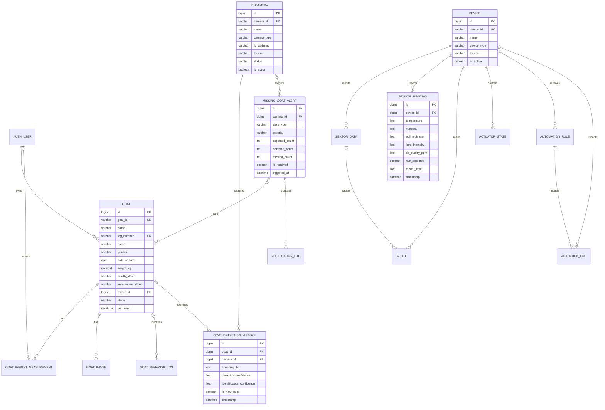

# Database Schema (Paper-Ready)

## Scope

This logical database schema documents the application data used by the Smart Goat Farm Management System. It is intended for Chapter 3, the system design section, or an appendix of the capstone paper. It does **not** require or describe any database migration.

The implementation uses MySQL through Django's object-relational mapper. Unless stated otherwise, every entity has an auto-generated `id` primary key. Foreign keys implement the relationships shown below. Django framework tables for permissions, sessions, migrations, cache, social login, and task scheduling are omitted because they are supporting framework data rather than the study's domain data.

## Figure 1. Core Farm, Goat, and Monitoring Schema



## Figure 2. Feeding and BLE Tracking Schema

```mermaid
erDiagram
    DEVICE ||--o{ FEED_SCHEDULE : schedules
    DEVICE ||--o| FEED_LEVEL : measures
    DEVICE ||--o{ FEED_LOG : records
    FEED_SCHEDULE o|--o{ FEED_LOG : generates

    GOAT o|--o| BLE_BEACON : assigned
    DEVICE ||--o| BLE_RECEIVER : configured_as
    BLE_BEACON ||--o{ BLE_TRACKING_STATE : has
    BLE_RECEIVER ||--o{ BLE_TRACKING_STATE : maintains
    BLE_BEACON ||--o{ BLE_OBSERVATION : emits
    BLE_RECEIVER ||--o{ BLE_OBSERVATION : detects
    GOAT o|--o{ BLE_OBSERVATION : snapshots

    FEED_SCHEDULE {
        bigint id PK
        bigint feeder_id FK
        time schedule_time
        int amount_grams
        json days_of_week
        boolean is_active
    }
    FEED_LEVEL {
        bigint id PK
        bigint feeder_id FK_UK
        int current_level_grams
        int capacity_grams
        int low_level_threshold
        float distance_cm
        int percentage
        datetime updated_at
    }
    FEED_LOG {
        bigint id PK
        bigint feeder_id FK
        bigint schedule_id FK
        int amount_dispensed
        varchar feeding_mode
        varchar trigger_reason
        varchar status
        datetime timestamp
    }
    BLE_BEACON {
        bigint id PK
        bigint goat_id FK_UK
        varchar mac_address UK
        varchar uuid
        int major
        int minor
        int battery_level
        boolean enabled
    }
    BLE_RECEIVER {
        bigint id PK
        bigint device_id FK_UK
        varchar platform
        varchar device_name
        varchar status
        datetime last_online
    }
    BLE_TRACKING_STATE {
        bigint id PK
        bigint beacon_id FK
        bigint receiver_id FK
        int current_rssi
        float smoothed_rssi
        varchar proximity
        varchar status
        datetime last_seen
    }
    BLE_OBSERVATION {
        bigint id PK
        bigint beacon_id FK
        bigint goat_id FK
        bigint receiver_id FK
        int rssi
        float smoothed_rssi
        varchar proximity
        datetime detected_at
    }
```

## Figure 3. Marketplace Schema

```mermaid
erDiagram
    AUTH_USER ||--o| SELLER_PROFILE : applies_as
    AUTH_USER ||--o| USER_ACCOUNT_STATE : has
    AUTH_USER ||--o{ GOAT : owns
    GOAT ||--o| MARKETPLACE_LISTING : advertised_as
    AUTH_USER ||--o{ MARKETPLACE_LISTING : sells
    MARKETPLACE_LISTING ||--o{ CONVERSATION : discussed_in
    AUTH_USER ||--o{ CONVERSATION : starts
    CONVERSATION ||--o{ MESSAGE : contains
    AUTH_USER ||--o{ MESSAGE : sends
    MARKETPLACE_LISTING ||--o{ RESERVATION : receives
    AUTH_USER ||--o{ RESERVATION : makes
    CONVERSATION o|--o{ RESERVATION : supports
    AUTH_USER }o--o{ MARKETPLACE_LISTING : favorites
    MARKETPLACE_LISTING ||--o{ MARKETPLACE_REPORT : reported_in
    AUTH_USER ||--o{ MARKETPLACE_REPORT : submits
    AUTH_USER ||--o{ SUPPORT_TICKET : opens
    SUPPORT_TICKET ||--o{ SUPPORT_MESSAGE : contains
    SUPPORT_MESSAGE ||--o{ SUPPORT_ATTACHMENT : has

    MARKETPLACE_LISTING {
        bigint id PK
        bigint goat_id FK_UK
        bigint seller_id FK
        decimal price
        text sales_description
        varchar status
        datetime published_at
        datetime sold_at
    }
    CONVERSATION {
        bigint id PK
        bigint listing_id FK
        bigint buyer_id FK
        varchar status
        datetime closed_at
    }
    MESSAGE {
        bigint id PK
        bigint conversation_id FK
        bigint sender_id FK
        text body
        boolean is_read
        datetime created_at
    }
    RESERVATION {
        bigint id PK
        bigint listing_id FK
        bigint buyer_id FK
        bigint conversation_id FK
        decimal agreed_price
        varchar status
        datetime reserved_at
        datetime expires_at
        datetime pickup_datetime
        varchar pickup_status
        datetime completed_at
    }
    FAVORITE {
        bigint id PK
        bigint user_id FK
        bigint listing_id FK
        datetime created_at
    }
    SUPPORT_TICKET {
        bigint id PK
        varchar ticket_number UK
        bigint user_id FK
        varchar subject
        varchar category
        varchar status
        varchar priority
        bigint assigned_to_id FK
        datetime created_at
    }
```

## Figure 4. Security, Machine Learning, and Reporting Schema

```mermaid
erDiagram
    AUTH_USER o|--o{ NOTIFICATION : resolves
    IP_CAMERA o|--o{ PERSON_DETECTION : captures
    AUTH_USER o|--o{ PERSON_DETECTION : reviews
    NOTIFICATION o|--o| PERSON_DETECTION : represents
    NOTIFICATION o|--o{ SMS_LOG : delivered_as
    SMS_REMINDER o|--o{ SMS_LOG : generates

    AUTH_USER o|--o{ ML_MODEL : uploads
    ML_MODEL o|--o{ DETECTION : performs
    DEVICE o|--o{ DETECTION : captures
    AUTH_USER o|--o{ REPORT : generates

    NOTIFICATION {
        bigint id PK
        varchar title
        text description
        varchar severity
        varchar notification_type
        varchar source
        boolean is_read
        boolean is_resolved
        bigint resolved_by_id FK
        datetime created_at
    }
    PERSON_DETECTION {
        bigint id PK
        bigint camera_id FK
        bigint notification_id FK_UK
        varchar detection_type
        float confidence
        json bounding_boxes
        varchar review_state
        bigint reviewed_by_id FK
        datetime detected_at
    }
    ML_MODEL {
        bigint id PK
        varchar name
        varchar category
        varchar model_type
        varchar version
        varchar status
        boolean is_active
        bigint uploaded_by_id FK
        float accuracy
    }
    DETECTION {
        bigint id PK
        bigint model_id FK
        bigint camera_id FK
        varchar image_url
        int goat_count
        float confidence
        json bounding_boxes
        datetime timestamp
    }
    SMS_LOG {
        bigint id PK
        bigint notification_id FK
        bigint reminder_id FK
        varchar sms_type
        varchar recipient
        text message
        varchar status
        datetime created_at
        datetime sent_at
    }
    REPORT {
        bigint id PK
        varchar title
        varchar report_type
        varchar export_format
        date start_date
        date end_date
        bigint generated_by_id FK
        datetime created_at
    }
```

## Entity Data Dictionary

| Module | Entity | Purpose | Important references |
|---|---|---|---|
| Accounts | `AUTH_USER` | Stores authenticated administrator, farm owner, seller, and buyer accounts. | Referenced by ownership, review, marketplace, reporting, and audit records. |
| Goat management | `GOAT` | Master record for each goat, including identity, breed, health, vaccination, ownership, and status. | `owner_id -> AUTH_USER` |
| Goat management | `GOAT_WEIGHT_MEASUREMENT` | Historical confirmed weight readings. | `goat_id -> GOAT`; `recorded_by_id -> AUTH_USER` |
| Goat management | `GOAT_IMAGE` | Identification and training images associated with a goat. | `goat_id -> GOAT` |
| Goat management | `GOAT_BEHAVIOR_LOG` | Detected individual or group behavior and environmental context. | Optional `goat_id -> GOAT` |
| Goat management | `GRASS_HEALTH_LOG` | Pasture greenness, vegetation density, environmental values, image, and analysis result. | Stand-alone monitoring record. |
| Vision | `IP_CAMERA` | Camera connection, location, status, and goat-detection settings. | Parent of goat and person detections. |
| Vision | `GOAT_DETECTION_HISTORY` | One camera detection/identification result at a particular time. | `goat_id -> GOAT`; `camera_id -> IP_CAMERA` |
| Vision | `MISSING_GOAT_ALERT` | Count discrepancy or missing-goat incident. | `camera_id -> IP_CAMERA`; many-to-many with `GOAT` |
| Vision | `NOTIFICATION_LOG` | Delivery attempt related to a missing-goat alert. | `alert_id -> MISSING_GOAT_ALERT` |
| IoT | `DEVICE` | Master record for sensors, feeders, actuators, cameras, and BLE receiver hosts. | Parent entity for readings, rules, logs, and feeding records. |
| IoT | `SENSOR_DATA` | Generic sensor value, unit, timestamp, and metadata. | `device_id -> DEVICE` |
| IoT | `SENSOR_READING` | Combined environmental reading from a farm device. | `device_id -> DEVICE` |
| IoT | `ALERT` | Device or sensor threshold alert and its resolution state. | `device_id -> DEVICE`; optional `sensor_data_id -> SENSOR_DATA` |
| IoT | `ACTUATOR_STATE` | Current state and operating mode of an actuator. | `device_id -> DEVICE` |
| IoT | `AUTOMATION_RULE` | Criteria, action, priority, and activation state of an automated rule. | `actuator_id -> DEVICE` |
| IoT | `ACTUATION_LOG` | Result and source of an actuator command. | `device_id -> DEVICE`; optional `rule_id -> AUTOMATION_RULE` |
| Feeding | `AUTOMATED_FEEDING_CONFIG` | Singleton-like master switch for automated feeding. | No domain foreign key. |
| Feeding | `FEED_SCHEDULE` | Scheduled feeding time, amount, active days, and status. | `feeder_id -> DEVICE` |
| Feeding | `FEED_LEVEL` | Current capacity and low-level measurements for one feeder. | One-to-one `feeder_id -> DEVICE` |
| Feeding | `FEED_LOG` | Completed or failed feeding event with operational context. | `feeder_id -> DEVICE`; optional `schedule_id -> FEED_SCHEDULE` |
| BLE tracking | `BLE_BEACON` | BLE tracker configuration and optional current goat assignment. | Optional one-to-one `goat_id -> GOAT` |
| BLE tracking | `BLE_RECEIVER` | Scanner host associated with an IoT device. | One-to-one `device_id -> DEVICE` |
| BLE tracking | `BLE_TRACKING_STATE` | Latest state of a beacon as seen by a receiver. | `beacon_id -> BLE_BEACON`; `receiver_id -> BLE_RECEIVER` |
| BLE tracking | `BLE_OBSERVATION` | Time-series RSSI and proximity observation. | `beacon_id -> BLE_BEACON`; `receiver_id -> BLE_RECEIVER`; optional goat snapshot |
| BLE tracking | `BLE_TRACKING_SETTINGS` | Global smoothing, threshold, timeout, and retention settings. | No domain foreign key. |
| Marketplace | `SELLER_PROFILE` | Farm details and seller approval information. | One-to-one `user_id -> AUTH_USER` |
| Marketplace | `MARKETPLACE_LISTING` | Price, description, publication, and sale state for one goat. | One-to-one `goat_id -> GOAT`; `seller_id -> AUTH_USER` |
| Marketplace | `CONVERSATION` | Buyer discussion for a listing. | `listing_id -> MARKETPLACE_LISTING`; `buyer_id -> AUTH_USER` |
| Marketplace | `MESSAGE` | Message within a buyer-seller conversation. | `conversation_id -> CONVERSATION`; `sender_id -> AUTH_USER` |
| Marketplace | `RESERVATION` | Buyer reservation, agreed price, expiry, pickup, cancellation, and completion state. | References listing, buyer, and optionally conversation. |
| Marketplace | `MARKETPLACE_ACTIVITY` | Audit trail for listing and reservation actions. | Optional listing/reservation; `actor_id -> AUTH_USER` |
| Marketplace | `FAVORITE` | User's saved listing. | `user_id -> AUTH_USER`; `listing_id -> MARKETPLACE_LISTING` |
| Marketplace | `MARKETPLACE_REPORT` | User-submitted complaint concerning a listing and its review. | `reporter_id -> AUTH_USER`; `listing_id -> MARKETPLACE_LISTING` |
| Marketplace | `MARKETPLACE_NOTIFICATION` | In-app marketplace notification linked to an affected record. | Recipient plus optional listing, conversation, reservation, report, or ticket. |
| Marketplace | `USER_ACCOUNT_STATE` | Marketplace account standing and administrative reason. | One-to-one `user_id -> AUTH_USER` |
| Marketplace | `USER_ACTIVITY` | Important account and administrative event audit log. | `user_id -> AUTH_USER`; optional `actor_id -> AUTH_USER` |
| Support | `SUPPORT_TICKET` | User concern, assignment, priority, status, and optional related transaction. | References user and optionally listing, conversation, and reservation. |
| Support | `SUPPORT_MESSAGE` | Reply within a support ticket. | `ticket_id -> SUPPORT_TICKET`; `sender_id -> AUTH_USER` |
| Support | `SUPPORT_ATTACHMENT` | Image or PDF evidence attached to a support message. | `message_id -> SUPPORT_MESSAGE` |
| Security | `NOTIFICATION` | Unified security/operations notification with read and resolution states. | Optional resolver and generic source record. |
| Security | `PERSON_DETECTION` | Camera person-detection event and review result. | Optional camera, reviewer, and one-to-one notification. |
| SMS | `SMS_SETTINGS` | Global SMS destination and alert/reminder preferences. | No domain foreign key. |
| SMS | `SMS_REMINDER` | Recurring scheduled SMS reminder. | Parent of `SMS_LOG`. |
| SMS | `SMS_LOG` | SMS content, provider response, delivery status, and error details. | Optional notification and reminder. |
| Machine learning | `ML_MODEL` | Uploaded model version, category, activation, validation, and accuracy. | Optional `uploaded_by_id -> AUTH_USER` |
| Machine learning | `DETECTION` | Model inference result for a device/camera image. | Optional `model_id -> ML_MODEL`; optional `camera_id -> DEVICE` |
| Analytics | `REPORT` | Generated report period, format, file path, and metadata. | Optional `generated_by_id -> AUTH_USER` |

## Main Cardinality and Integrity Rules

1. One user may own many goats, but each goat has at most one current owner.
2. One goat may have many images, weight measurements, behavior logs, and detection-history records.
3. A goat may have at most one active marketplace listing and at most one assigned BLE beacon.
4. One device may produce many sensor readings, alerts, feeding events, and actuation records.
5. A feeder device has at most one current feed-level record but may have many schedules and logs.
6. A marketplace conversation belongs to one listing and one buyer; it may contain many messages and reservations.
7. A favorite must be unique for a given user-listing pair, preventing duplicate saved listings.
8. A BLE tracking state represents one beacon-receiver pair, while observations preserve the time-series history.
9. One person-detection record may point to one unified notification, avoiding duplicate alerts for the same detection.
10. Historical and audit records retain timestamps so transactions, detections, commands, and administrative actions remain traceable.

## Paper Narrative

The database follows a modular relational design centered on the `GOAT`, `DEVICE`, and `AUTH_USER` entities. The goat-management tables preserve animal identity, health, weight, images, behavior, and detection history. IoT and feeding tables store environmental readings, device alerts, actuator commands, feed schedules, feed levels, and feeding outcomes. BLE entities maintain each tracker's assignment, receiver state, and time-series proximity observations. Marketplace entities connect goat ownership with seller listings, buyer conversations, reservations, support records, and audit trails. Security, machine-learning, SMS, and analytics entities provide detection review, notification delivery, model versioning, and report generation. Primary keys uniquely identify records, while foreign keys and uniqueness constraints maintain referential integrity and reduce duplicate data.

**Suggested figure caption:** *Logical database schema of the Smart Goat Farm Management System, showing the main entities, attributes, and relationships across goat monitoring, IoT automation, feeding, BLE tracking, marketplace, security, and analytics modules.*

## Notation

- `PK` — primary key
- `FK` — foreign key
- `UK` — unique key
- `FK_UK` — a foreign key that is also unique (one-to-one relationship)
- `||` — exactly one
- `o|` — zero or one
- `o{` — zero or many
- `}o--o{` — many-to-many
